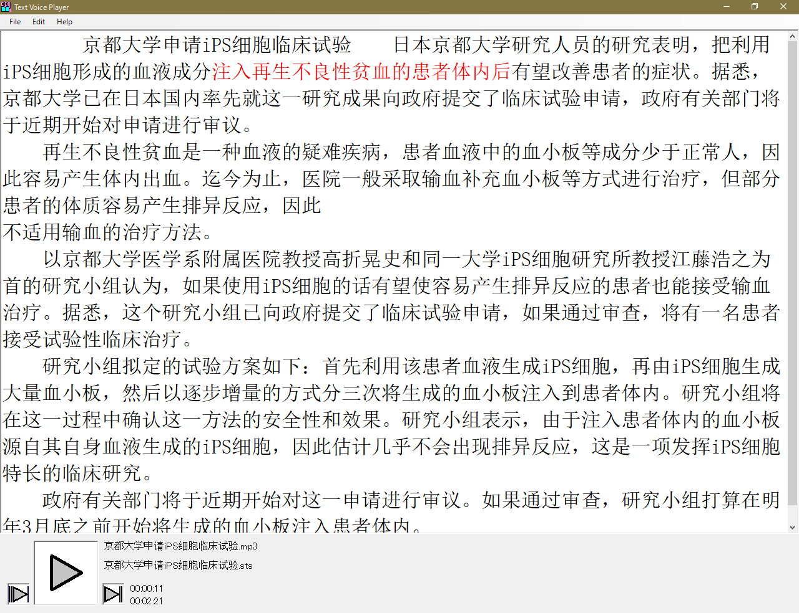

# TextVoicePlayer


## アプリの説明
このアプリケーション[TextVoicePlaer](https://github.com/let-us-study-with-textvoice/TextVoicePlayer)は、mp3など音声ファイルとその内容を書き起こしたテキストファイルに埋め込んだタイムスタンプから、音声に同期したテキスト部分を強調表示する語学学習用の音声再生プレーヤーである。



時間タグを埋め込んだテキストファイルは、拡張子がstsになり、フォーマットは次のようになる。
これは、音楽ファイルにその歌詞を表示させるlrcファイルの考え方を拡張した。


フォーマット
```
[開始時間(分:秒.1/100秒)]テキスト文字[/終了時間(分:秒.1/100秒)]
```

stsファイルの実際の例
```
[00:01.03]　　日本京都大学研究人员的研究表明，[/00:03.74][00:04.10]把利用iPS细胞形成的血液成分[/00:07.42][00:07.68]注入再生不良性贫血的患者体内后[/00:11.00][00:11.39]有望改善患者的症状。[/00:13.20][00:14.01]据悉，[/00:14.31][00:14.76]京都大学已在日本国内率先就这一研究成果[/00:18.63][00:18.84]向政府提交了临床试验申请，[/00:21.76][00:22.95]政府有关部门将于近期开始对申请进行审议。[/00:26.57]
```


## stsファイルをつくるためには、
音声ファイルに同期したテキストファイルにタイムスタンプを埋め込むためのstsファイルを作るためには、[SentenceTimeStamper](https://github.com/let-us-study-with-textvoice/SentenceTimeStamper)を使う。


## 使用した技術
このアプリには、[NAudio](https://github.com/naudio/NAudio)を使用している。